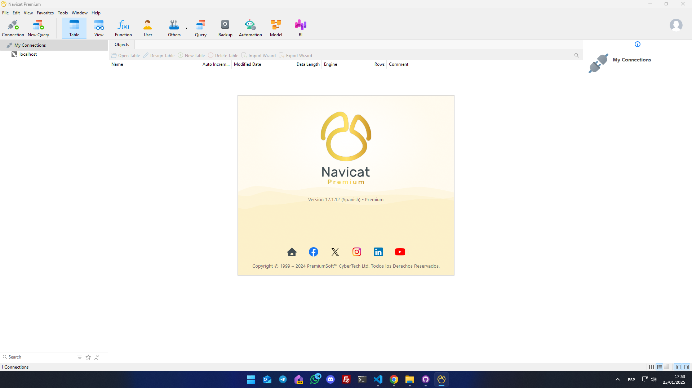

# Navicat Premium Cracker (v17)

## Overview
Navicat Premium is a comprehensive database management tool that supports multiple database types such as MySQL, PostgreSQL, SQLite, and more. It offers a user-friendly interface, advanced tools for data modeling, seamless data migration, and an efficient query editor, making it a favorite among developers and database administrators.

### Benefits of Navicat Premium:
- **Cross-Database Management:** Manage multiple databases from a single platform.
- **Data Transfer and Synchronization:** Seamlessly migrate data between databases.
- **Visual Query Builder:** Create complex queries without writing SQL code.
- **Data Visualization:** Generate detailed reports and charts for data analysis.
- **Advanced Security Features:** Protect sensitive data with robust encryption.

This guide provides simple and clear instructions to enable Navicat Premium v17 using a custom cracker. With just a few steps, you can unlock the full features of Navicat without limitations.
This guide provides simple and clear instructions to enable Navicat Premium v17 using a custom cracker. With just a few steps, you can unlock the full features of Navicat without limitations. 

### Key Details:
- **Compatibility:** Navicat v17.3.6 (32-bit and 64-bit systems).
- **Files Needed:** A patched winmm.dll file that replaces the original.
- **Purpose:** Quickly set up Navicat with all its features active.

---

## Prerequisites

1. **Download Navicat v17:**
   - Get version 17 of Navicat from its [official website](https://www.navicat.com/store/navicat-premium-plan)

2. **Download the resouce:**
   - Obtain the required files from [download resouce](https://github.com/zarfadev/Navicat_Patch_v17/blob/main/Navicat_17.x.zip).

---

## Usage Instructions

### 1. **Close Navicat**
- Ensure that Navicat is completely closed. If the program is running, close it before proceeding.

### 2. **Prepare the DLL File**
- **Extract the downloaded file**: Unzip the cracker files to an accessible location.
- Depending on your operating system architecture, select the appropriate file:
  - **32-bit system:** Use the winmm.dll file from x32_Patch.zip.
  - **64-bit system:** Use the winmm.dll file from x64_Patch.zip.

### 3. **Replace the DLL File**
- Copy the selected winmm.dll file and paste it into the Navicat installation directory. The default location is usually:
  - C:\Program Files\PremiumSoft\Navicat (64-bit)
  - C:\Program Files (x86)\PremiumSoft\Navicat (32-bit)

### 4. **Start Navicat**
- Launch Navicat as usual. If all steps were followed correctly, the cracker should work.

---

## Important Notes

1. **Version Compatibility:**
   - This cracker has been verified for Navicat version **17.3.6**.
   - Ensure that your version is compatible.

>Latest Verified Version：V17.3.6

2. **Select the Correct File:**
   - Verify whether your system is 32-bit or 64-bit to avoid errors when using the DLL file.

3. **Avoid Updates:**
   - Do not update the software after applying the cracker, as it might stop working.

---

## FAQ (Frequently Asked Questions)

1. **Where is the Navicat installation directory?**
   - Right-click on the Navicat icon on your desktop or start menu and select "Open file location."

2. **What if the winmm.dll file doesn't work?**
   - Ensure that you selected the correct file for your system architecture.
   - Double-check that Navicat is fully closed before replacing the file.

3. **Does the cracker work for versions earlier than 17?**
   - This cracker is optimized for version 17. It may not work correctly on earlier versions.

---

### ⭐ Show Your Support
If this guide helped you, please consider leaving a star on GitHub! Your support motivates us to keep creating valuable content for the community.
